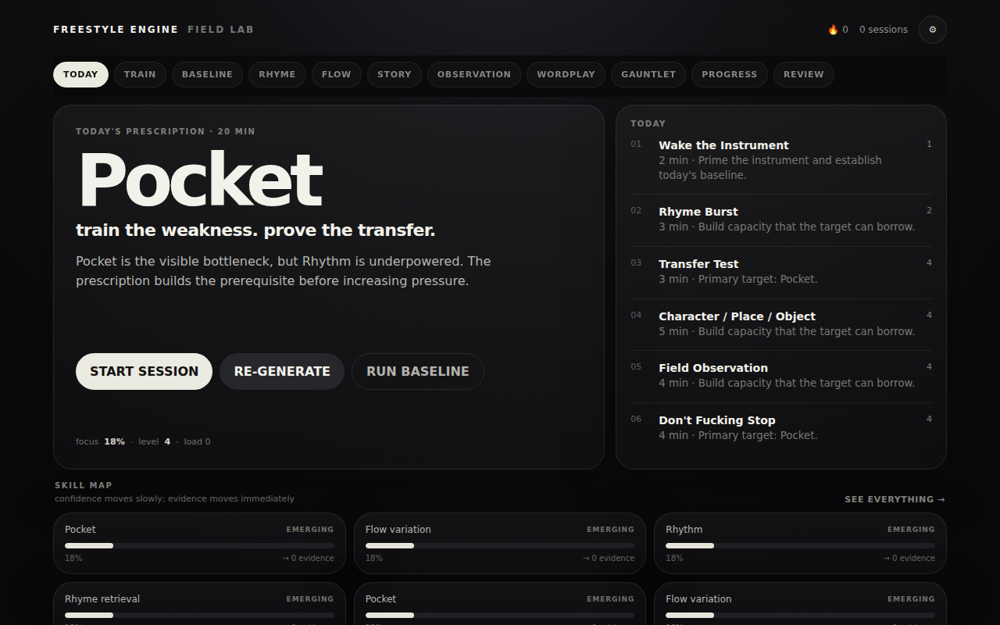

# FREESTYLE ENGINE

A browser practice tool for freestyle rap that scores each recorded take from its audio and transcript and plans the next workout from the results. It tracks 21 skills, such as rhyme retrieval and storytelling, and builds each day's six-drill workout around one focus skill. Profiles and recordings stay in the browser, and the app has no accounts and no backend. It is built with TypeScript, plain DOM and CSS, the Web Audio, MediaRecorder and Web Speech APIs, and IndexedDB.

**Status: prototype.** Calibration, the beat, recording, review and the adaptive plan all run, but every score is a proxy and transcription works only in browsers that provide speech recognition.

Live: https://ampactor.dev/freestyle-engine/



## Quick start

With Node 22 (the version CI uses):

```bash
npm install
npm run dev
```

Open the local URL that Vite prints. The Today screen shows the day's plan. Until the baseline is done, START SESSION opens BASELINE, a calibration of eight tasks (about 11 minutes in all) that sets the starting profile. The browser asks for the microphone when a task starts. In a browser with the Web Speech API, such as Chrome, the take also gets a live transcript.

## How it works

A take moves through the app in one pass. The recorder captures audio while the Web Speech API transcribes it. When the take ends, the audio analysis measures the recording, each distinct word of the transcript is looked up for its pronunciation, and the transcript analysis turns both into metrics and 21 skill scores. You then rate the take on six sliders. The evaluation blends your ratings with the measurements, the profile updates, and the session and recording are saved to IndexedDB. The next workout comes from the updated profile. Review lists the 60 most recent sessions, and each opens with its transcript, measurement receipts, strongest rhyme chains, failure modes and recording.

Two terms from the app come up often. Pocket is staying locked to the beat. Transfer is whether a skill that works in its own drill survives in a harder, mixed task.

| Part | Files | What it does |
| --- | --- | --- |
| Recording | `src/services/recorder.ts` | MediaRecorder with echo cancellation, noise suppression and auto gain turned off, and a live input meter during the take. |
| Audio analysis | `src/services/audio-analysis.ts` | Decodes the take and reads it in 2048-sample frames: silence, phrase starts, onsets (the start of each new sound), voiced frames, pitch range by autocorrelation, dynamic range and clipping. When the beat was on, it also measures how far each onset lands from the nearest beat. |
| Transcription | `src/services/speech.ts` | The browser's Web Speech API in US English, running continuously, with interim results shown live. |
| Phonology | `src/core/phonology.ts` | Labels each pair of neighbouring words a perfect rhyme, multisyllabic rhyme, near rhyme, assonance (shared vowel sounds) or consonance (shared consonants). From those links it counts end rhymes, internal rhymes and rhyme chains (runs of consecutive linked words). |
| Transcript analysis | `src/core/analysis.ts` | Speech rate, filler words, vocabulary diversity, repeated words and prompt hits. It turns these and the audio measurements into 21 inferred skill scores and seven failure modes, such as "Filler loop" and "Timing drift". |
| Evaluation | `src/core/evaluation.ts` | Scores a drill as 50% measurement, 20% transfer, 15% self-rating, 10% difficulty and 5% completion. |
| Profile | `src/core/profile.ts` | Confidence per skill, streaks, recurring failure modes, transfer history and training load. |
| Calibration | `src/core/calibration.ts` | The eight baseline tasks: rhyme, pocket, story, observation, recovery, voice, wordplay and transfer. |
| Curriculum | `src/core/curriculum.ts`, `src/core/generator.ts` | Picks the focus skill and builds the six-drill workout. |
| Beat | `src/services/audio.ts` | A Web Audio kick, clap and hi-hat pattern at the chosen BPM. |
| Storage | `src/services/store.ts` | IndexedDB stores for sessions, recordings, and the profile and settings. The lookup cache and the optional Datamuse key live in `localStorage`. |
| UI | `src/main.ts`, `src/ui/styles.css` | Eleven screens (Today, Train, Baseline, Rhyme, Flow, Story, Observation, Wordplay, Gauntlet, Progress and Review) rendered as HTML strings, plus the trainer, self-rating, result and settings views. A setting called performance mode, on by default, enlarges the prompt to fill most of the screen during a take. |

### Choosing the next workout

The focus skill is the one with the highest priority score (`skillLeverage` in `src/core/curriculum.ts`). Low confidence carries most of the weight (0.52), then weak prerequisites (0.16) and days since the skill was last practised, capped at a week (0.14). A falling trend adds 0.12, and fewer than four pieces of evidence add 0.16. Prerequisites are a fixed map: internal rhyme depends on rhyme retrieval, flow variation on pocket and rhythm, and so on.

The workout fills six roles in order (warm-up, base, target, transfer, creative and a final boss drill) from the 12 drills in `src/content/exercises.ts`. Each role has its own pool: the base comes from rhyme and flow drills, the target from drills that train the focus skill, and so on. A seeded random generator keyed to the UTC date picks one drill from each pool, which keeps the plan the same all day until you press RE-GENERATE.

Drill difficulty is capped at a level set by the focus skill's confidence (confidence times 10, rounded, plus 2). Training load is minutes times difficulty for each session, and a high seven-day load lowers the cap further: to 8 above 350, 6 above 600 and 4 above 900. When the seven-day load passes 1.35 times the recommended load (300 before calibration, 420 after), the Today screen recommends a deload.

### Design decisions

- Each metric is saved with the evidence behind it and a confidence value. The evidence is a line of text, for vocabulary diversity "`<n>` unique tokens / `<m>` total tokens.", and Review shows it beside the number.
- Scoring uses fixed formulas in `src/core` and no language model, so the same inputs always give the same scores.
- The profile moves slowly. A new score moves a skill's confidence at most a tenth of the way toward it, plus a nudge of 0.015 up for a score above 0.8 or 0.012 down for one below 0.22.
- Your self-rating counts for less than the measurements. It supplies 45% of the coherence, pocket and vocal dynamics scores and 30% of association.
- Transfer is tracked apart from drill scores. Each session records a transfer score for the workout's transfer target, and Progress shows the average of the last eight per skill.

### Language providers

The app uses two public word services as sources of evidence. The training logic stays in `src/core`.

[Datamuse](https://www.datamuse.com/api/) is the main one. The Rhyme lab uses it for exact rhymes, near rhymes, related words, sound-alikes and synonyms. After a take, the analysis asks it for each word's pronunciation in ARPAbet (a phoneme spelling of English), syllable count and definition. When Datamuse has no pronunciation, the app asks the [Free Dictionary API](https://dictionaryapi.dev/) for IPA, a definition and pronunciation audio. The rhyme engine reads only ARPAbet, so for those words, and whenever the network is down, it falls back to a guess from spelling.

Recordings and whole transcripts are never sent to either service. Each distinct transcript word is looked up on its own, five requests at a time, and results are cached in `localStorage` for 30 days. Datamuse allows up to 100,000 requests a day without a key, and its API page says a key will be required from January 1, 2027. Settings already accepts an optional Datamuse key.

[`FREESTYLE_ENGINE_DESIGN.md`](FREESTYLE_ENGINE_DESIGN.md) is the original design specification. It describes more than the code does, for example OPFS storage and an optional AI coaching layer, so read it as a plan.

## Project layout

```text
src/core/                  scoring, phonology, profile, calibration, curriculum, workout generator
src/services/              recorder, audio analysis, beat, speech, IndexedDB store, word services
src/content/               the 12 drills and the prompt word lists
src/main.ts                every screen, rendered as HTML strings
scripts-build.mjs          production build (tsc, no Vite)
scripts-core-test.mjs      smoke test run by npm test
tests/core.test.ts         Vitest suite that no npm script runs
.github/workflows/pages.yml  build and deploy to GitHub Pages
```

## Deploy

The live site runs on GitHub Pages at https://ampactor.dev/freestyle-engine/. Every push to `main` runs `.github/workflows/pages.yml`, which installs dependencies on Node 22, runs `npm run build` and publishes `dist/`. The workflow can also be started by hand from the Actions tab.

### Production build

```bash
npm run build
```

The production build does not use Vite, which serves only `npm run dev`. `scripts-build.mjs` runs `tsc` with `tsconfig.build.json`, which type-checks all of `src/` in strict mode and emits JavaScript to `dist/`. It then adds `.js` to relative import paths so the browser can load the modules, copies `styles.css`, points `index.html` at both, and writes `.nojekyll`. The result is plain static files that any web server can host.

## Testing

```bash
npm run build
npm test
```

```
CORE_TESTS_OK
```

`npm test` runs `scripts-core-test.mjs` against the compiled modules in `dist/`, so it needs a build first. Without one it fails with `ERR_MODULE_NOT_FOUND`. It checks five things:

- the phonology finds a four-word rhyme chain in "light night bright fight";
- the transcript analysis finds rhyme links and the most repeated word;
- a profile update counts the session;
- a generated workout has six blocks and a focus skill;
- a version 2 profile gains the training-load and calibration fields when loaded.

Outside these five checks, the only automated check is the build's strict type check over `src/`. CI runs the build, so a type error stops a deploy, but CI does not run `npm test`.

`tests/core.test.ts` is a Vitest suite of three tests that no npm script runs. `npx vitest run` reports:

```
      Tests  1 failed | 2 passed (3)
```

The failing test ("adapts profile from real skill evidence") finds a real bug: `updateProfileFromSession` changes the skills of the profile passed to it, so the old and new profiles hold the same values.

`npm run test:e2e` calls Playwright, which is not in `package.json`, and there are no end-to-end tests. With a global Playwright it stops at `Error: No tests found`. The screens, recording, audio analysis, speech recognition, IndexedDB and the word services have no automated tests.

## Limitations

Every score is a proxy. Rhyme, timing and filler counts come from a speech transcript and from pronunciations that are looked up online or guessed from spelling, and nothing in the engine can tell whether a bar was good. Transcripts come from the browser's Web Speech API, which Firefox does not provide, so in Firefox the word-based scores have no words to count.

- **Transcription belongs to the browser.** In Chrome the recognizer is a Google web service, so the audio of a take leaves the device to be transcribed even though the app has no server of its own.
- **Transcript words leave the browser.** Each distinct word is sent on its own to Datamuse, and to the Free Dictionary API when Datamuse has no pronunciation.
- **The recognizer was built for dictation.** Fast delivery, slang and deliberate slurring are where a dictation engine drops words, and the rhyme and filler scores can only count the words it kept.
- **Bars are guessed.** A transcript has no bar lines, so the phonology treats every four words as a bar when it counts end and internal rhymes.
- **Beat alignment is coarse.** It is measured only when the beat was running during the take, and only against the beat itself. An onset exactly halfway between two beats scores as fully off the grid, so a flow on eighth notes scores as badly timed.
- **The workout picker ignores its own ranking.** `src/core/generator.ts` sorts each pool by how well each drill fits the focus skill, recent practice and training load, then picks from the whole pool uniformly at random, so the sort has no effect. The deload penalty on drills above difficulty 6 lives in that ranking and has no effect either.
- **The beat has one pattern.** The kick, clap and hi-hat pattern is fixed, and only the tempo changes.
- **One browser holds everything.** The profile, sessions and recordings live in IndexedDB. EXPORT in Review saves the profile and session history as JSON without the recordings, and clearing site data without an export starts the profile over.
- **Two display bugs.** `updateProfileFromSession` also changes the profile passed to it (see Testing), so the result screen after a take always shows a profile change of 0. The session detail page rounds a score between 0 and 1, so it shows 0 or 1.
- **The Datamuse key is untested.** The app sends it as a `token` query parameter, and the Datamuse page does not yet say which parameter it will expect.

## License

No license chosen yet.
